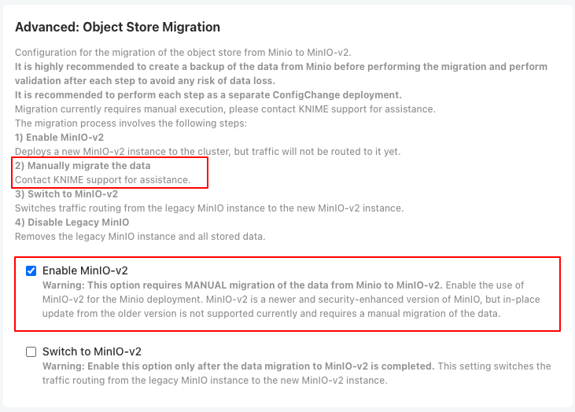
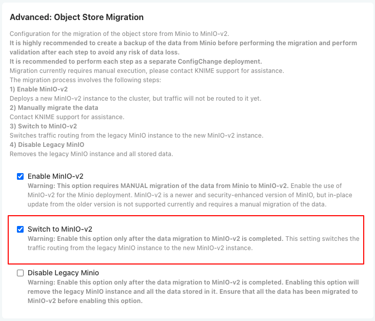
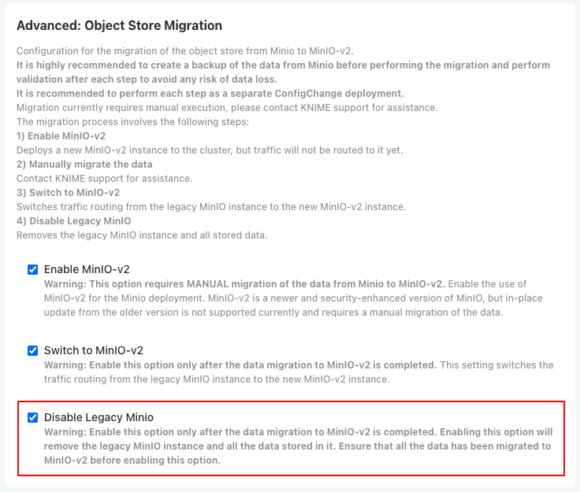

# MinIO to MinIO v2 migration guide

> **Note:** This guide is relevant for Replicated kURL based installs upgrading to version **1.18.0** or newer. The migration described here is **optional** (you can run it to copy existing MinIO data to MinIO v2); it will be **automated in upcoming releases**.

This guide explains how to run the manual MinIO v2 migration job to copy data from your existing MinIO instance to MinIO v2. Use this when migrating to the new MinIO v2 backend. The deployment and traffic switch are managed by KOTS config in **Advanced: Object Store Migration** which is only visible when the **View Advanced Settings** option is enabled in the **Global** section.

> **Important — Check disk space before migrating**  
> Ensure there is enough free disk space on the node (or storage volume) for the migration, since data is copied in-cluster from the existing MinIO to MinIO v2. You can:
>
> - **From the MinIO pod:** `kubectl exec` into the MinIO pod and run `du -sh /export` to get the data size. Compare it with the available space shown by `df` inside the same pod (for instance, when using OpenEBS this reflects the node's available space).
> - **From the node:** Run `df` on the node and compare the free space with the size from `du -sh /export` in the pod.
>
> If there is not enough space for both the existing data and the migrated copy, increase the disk (or volume) size before running the migration.

## Step-by-step migration

The migration must be run **after** you enable MinIO-v2 in KOTS and **before** you enable the "Switch to MinIO-v2" option. Perform each step in order; it is recommended to do each as a separate ConfigChange deployment and to create a backup of MinIO data before starting.

| Step | Action | Type | When |
|------|--------|------|------|
| 1 | Enable MinIO-v2 | KOTS ConfigOption | Do this first. |
| 2 | Run the migration job | Manual | **After step 1, before step 3.** |
| 3 | Switch to MinIO-v2 | KOTS ConfigOption | Only after migration has completed successfully. |
| 4 | Disable Legacy MinIO (optional) | KOTS ConfigOption | After you have validated MinIO v2. |

---

### Step 1: Enable MinIO-v2

In the KOTS Admin Console, go to **Advanced: Object Store Migration**. Check **Enable MinIO-v2** and deploy. This deploys a new MinIO v2 instance; traffic still goes to the legacy MinIO.



Do **not** enable "Switch to MinIO-v2" yet. Proceed to Step 2.

---

### Step 2: Manually migrate MinIO data

Run the migration job to copy data from the legacy MinIO to MinIO v2. See [Prerequisites](#prerequisites), [Customizing the namespace](#customizing-the-namespace), and [Running the migration](#running-the-migration) below for details.

Only after the job completes successfully (you see `MinIO migration completed successfully.`) continue to Step 3.

---

### Step 3: Switch to MinIO-v2

Back in **Advanced: Object Store Migration**, check **Switch to MinIO-v2** and deploy. This switches traffic from the legacy MinIO instance to MinIO v2.



Validate that the Hub works correctly with MinIO v2 before Step 4.

---

### Step 4: Disable Legacy MinIO (optional)

When you no longer need the old instance, check **Disable Legacy Minio** and deploy. This removes the legacy MinIO instance and all data stored in it. Ensure all data has been migrated and validated before enabling this option.



## Prerequisites

- **Kubernetes cluster** with both source MinIO and MinIO v2 deployed in the same namespace.
- **Secrets** `minio` and `minio-v2` must exist in the target namespace with keys:
  - `minio`: `rootUser`, `rootPassword`
  - `minio-v2`: `rootUser`, `rootPassword`
- **Destination buckets** must already exist on MinIO v2. These buckets are bootstrapped during MinIO-v2 deployment automatically. The job checks for these and fails if any are missing:
  - `knime-accounts-service-avatars`
  - `knime-catalog-service`
  - `knime-customization-profiles`
  - `knime-execution-jobs`
  - `knime-postgres-backup`

## Customizing the namespace

The migration job talks to MinIO and MinIO v2 via in-cluster DNS:

- Source: `http://minio.<namespace>.svc.cluster.local:9000`
- Destination: `http://minio-v2.<namespace>.svc.cluster.local:9000`

You **must** set the namespace to the one where MinIO and MinIO v2 are running.

1. Open the job manifest: [manual-minio-v2-migration-job.yaml](./manual-minio-v2-migration-job.yaml).

2. Set the job’s namespace in **two** places:

   **a) Job metadata (where the Job runs):**

   ```yaml
   metadata:
     name: minio-v2-migration
     namespace: <YOUR_NAMESPACE>   # e.g. knime, knime-hub
   ```

   **b) Environment variable (used for service DNS):**

   ```yaml
   env:
     - name: NAMESPACE
       value: <YOUR_NAMESPACE>   # must match the namespace above
   ```

   Replace `<YOUR_NAMESPACE>` with your actual namespace (e.g. `knime`, `knime-hub`). By default the job uses `knime` namespace as this is the default for KNIME Hub installations.

3. Ensure the secrets `minio` and `minio-v2` exist in that same namespace and that the job’s `secretKeyRef` names and keys match your setup (defaults are `minio` / `minio-v2` with `rootUser` and `rootPassword`).

## Running the migration

1. Save the edited job manifest (e.g. `manual-minio-v2-migration-job.yaml`).

2. Apply the job:

   ```bash
   kubectl apply -f manual-minio-v2-migration-job.yaml
   ```

3. Watch the job and logs:

   ```bash
   kubectl -n <YOUR_NAMESPACE> get jobs
   kubectl -n <YOUR_NAMESPACE> logs job/minio-v2-migration -f
   ```

4. The job:
   - Configures `mc` aliases for source and destination.
   - Verifies connectivity to both MinIO and MinIO v2.
   - Checks that all required buckets exist on the destination.
   - Mirrors each bucket from source to destination with `mc mirror --overwrite`.

   On success you’ll see: `MinIO migration completed successfully.`

## Troubleshooting

- **"Cannot access source MinIO"** – Check that MinIO is running in `<YOUR_NAMESPACE>` and that the `minio` secret has the correct `rootUser`/`rootPassword`.
- **"Cannot access destination MinIO"** – Check that MinIO v2 is running in the same namespace and that the `minio-v2` secret is correct.

After a successful run, go to the KOTS Admin Console → **Advanced: Object Store Migration**, enable **Switch to MinIO-v2**, and deploy. Once traffic is on MinIO v2 and you have validated it, you can optionally enable **Disable Legacy Minio** to remove the old instance.
