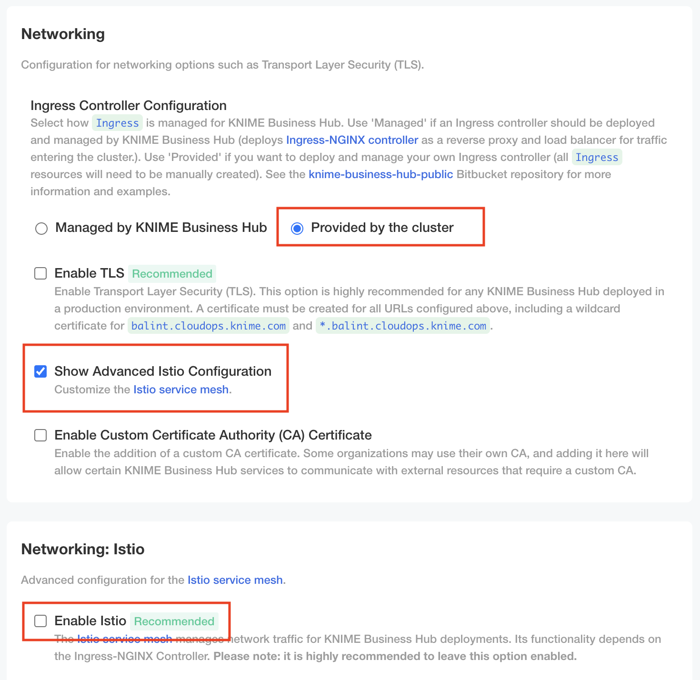

# Minimal RBAC

By default KOTS installation utilizes ClusterRoles and ClusterRoleBindings to install and manage applications. KOTS however supports an installation method that uses [Namespace-scope RBAC](https://docs.replicated.com/vendor/packaging-rbac#min-rbac) permissions instead of the cluster scoped ones.

> **This feature is only available for non-kurl (non-embedded) installations and the feature can only be turned on when initially installing KOTS, upgrading a running KOTS instance is not possible.**

KOTS can be installed in Minimal RBAC mode following the steps below.

## 1. Install KOTS CLI and KOTS

Install [KOTS CLI](https://docs.replicated.com/reference/kots-cli-getting-started#install) (if it is not installed already):
```sh
curl https://kots.io/install | bash
```

Install KOTS:
```sh
kubectl kots install knime-hub --use-minimal-rbac
```

The `--use-minimal-rbac` option of the `kots install` command will ensure that KOTS is installed with namespace-scoped Roles and RoleBindings.

## 2. Preparing the cluster for installing knime-hub

The majority of ClusterRoles and ClusterRoleBindigs have already been eliminated from the stack of Knime Business Hub, however there are still some services which rely on these cluster scoped permissions.

Due to these dependencies, installation with minimal RBAC mode enabled can only succeed if the following prerequisites are <u>fulfilled</u>:

1.  [Customer installs CustomResoureDefinitions.](https://bitbucket.org/KNIME/knime-business-hub-public/src/main/crds/)
2.  [Customer installs ingress-nginx and creates necessary IngressRules.](https://bitbucket.org/KNIME/knime-business-hub-public/src/main/networking/ingress-nginx/)
3.  [Customer installs istio.](https://bitbucket.org/KNIME/knime-business-hub-public/src/main/networking/istio/)
4.  [Customer applies necessary ClusterRoles and ClusterRoleBindings.](https://bitbucket.org/KNIME/knime-business-hub-public/src/main/security/clusterroles/)

## 3. Installing knime-hub

When installing knime-hub into and enviroment that is running in namespace-scoped RBAC mode, certain configurations are required to be set/unset in order to match the prerequisites that were explained in the previous step.

1. **Enable** the `View Advanced Settings` option in the Global section to display advanced configuration options.
    
2.  Set the Ingress Controller Configuration to the `Provided by the cluster` option. **Enable** the `Show Advanced Istio Configuration` and **disable** the `Enable Istio` option in the Networking: Istio section.
    
3.  In the Advanced: Kubernetes Cluster Management section **disable** `Enable Automatic Deployment and Updates for Custom Resource Definitions (CRDs)` and `Enable Cluster Role Provisioning` options.
    > Leave the `Add istio injection label to hub namespace` enabled or disable it if the condition applies.

    
