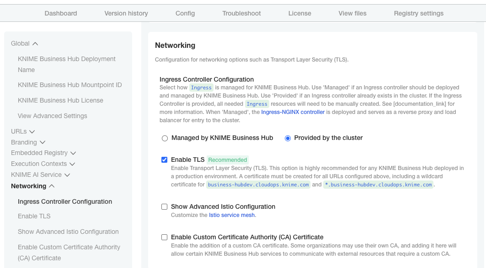

# ingress-nginx

KNIME Business Hub deploys and uses ingress-nginx for traffic ingress. However, the options exposed in the KOTS admin console are not enough to cover most existing cluster scenarios, and in some clusters there's an ingress controller already deployed that should be reused. In those cases KNIME Business Hub can be configured to not deploy ingress-nginx, and instead rely on the cluster operator to deploy necessary resources.

## Prerequesites

- `kubectl` matching the cluster version
- latest `helm` version, if installing ingress-nginx using a helm chart https://helm.sh/docs/intro/quickstart/

> **Note**: Some features in KNIME Business Hub, eg the Job Viewer, use websockets. If an external proxy or load balancer is used it needs to be websocket compatible. 

> **Note**: If you want to generate Routes for Openshift refer to the Openshift section below.

## Deploy ingress-nginx

If an ingress-nginx controller is not already deployed in the cluster you'll need to deploy one first. We are using the [official ingress-nginx chart developed by the Kubernetes project](https://github.com/kubernetes/ingress-nginx).

Start by adding the ingress-nginx helm repository to your local helm installation:

```
helm repo add ingress-nginx https://kubernetes.github.io/ingress-nginx
helm repo update
```

In [ingress-nginx-values.yaml](ingress-nginx-values.yaml) you'll find an example values file as a starting point. Please consult your cloud providers documentation on loadbalancer implementations and necessary custom service annotations.

After configuring the values file deploy the helm chart: 

```
helm upgrade -i -n <namespace> <release name> ingress-nginx/ingress-nginx --version <version> -f <values file>
```

Example:

```
helm upgrade -i -n knime business-hub-ingress-nginx ingress-nginx/ingress-nginx --version 4.9.0 -f ingress-nginx-values.yaml
```

**Please note**:

- If deploying in the `knime` namespace do not use `ingress-nginx` as the release name, as KOTS will think it needs to manage this release, and will ultimately delete it
- KNIME Business Hub has been tested with ingress-nginx chart version 4.9.0

## Deploy Ingress resources

In [ingress.yaml](ingress.yaml) you'll find Ingress resources needed for KNIME Business Hub that can be further configured to fit your desired ingress strategy.

You will need to replace the `<business-hub-namespace>` and `<istio-system-namespace>` placeholders with the namespace KNIME Business Hub and Istio is installed in, for example using `sed`:

```
sed -i "s/<business-hub-namespace>/knime-business-hub/g" ingress.yaml
sed -i "s/<istio-system-namespace>/knime-business-hub-istio/g" ingress.yaml
```

In each Ingress resource you will also need to replace the `<baseurl>` placeholder with the Webapp URL configured in the KOTS admin console, for example using `sed`:

```
sed -i "s/<baseurl>/hub.example.com/g" ingress.yaml
```

If you are using an ingress controller other than the one recommended here, replace the `ingressClassName` of each `Ingress` resource, for example using `sed`:

```
sed -i "s/<ingressclass>/business-hub/g" ingress.yaml
```

To use TLS, make sure the TLS certificate `Secret` exists and replace the certificate placeholder, for example using `sed`:

```
oc --namespace <business-hub-namespace> create secret tls knime-business-hub-cert-bundle-secret --cert=hub-fullchain.pem --key=hub-privatekey.pem
oc --namespace <istio-system-namespace> create secret tls knime-business-hub-cert-bundle-secret --cert=hub-fullchain.pem --key=hub-privatekey.pem
sed -i "s/<cert-secret-name>/knime-business-hub-cert-bundle-secret/g" ingress.yaml
```

After modifying the resources, deploy them to the cluster:

```
kubectl apply -f ingress.yaml
```

## Configure KNIME Business Hub

To configure KNIME Business Hub to use a cluster-provided ingress controller: in the KOTS admin console go to the Config tab and first enable the "View Advanced Settings" option that you can find in the Global section at the top. Afterwards go to the Networking section and for "Ingress Controller Configuration" select "Provided by the cluster". Select the "Enable TLS" option if KNIME Business Hub will be secured with TLS, either by the ingress-nginx controller or a loadbalancer.



## Openshift

If you are deploying into an Openshift cluster you can use the default HAProxy ingress controller instead of ingress-nginx. Openshift will generate Route resources automatically as long as the `ingressClassName` of each `Ingress` resource is changed to that of the controller. By default this will be `openshift-default`. If you do not want these Routes to terminate TLS, comment out the TLS block in each Ingress rule.

> See [Openshift Docs: Route Creation From Ingress](https://docs.openshift.com/container-platform/latest/networking/routes/route-configuration.html#nw-ingress-creating-a-route-via-an-ingress_route-configuration)
 for more details on configuration options.

> See [Openshift Docs: Create Route With Default Certificate](https://docs.openshift.com/container-platform/latest/networking/routes/route-configuration.html#creating-edge-route-with-default-certificate_route-configuration)
 for more details on managing certificate credentials inside a Route.

 Please note that we set the following values in our nginx controller that may need to be configured on the Openshift router if you experience any issues.

- proxy-buffer-size: 64k
- proxy-buffering: 'on'
- proxy-buffers-number: '4'
- proxy-body-size: 0
- proxy-connect-timeout: 60
- proxy-read-timeout: 1800
- proxy-send-timeout: 1800
- use-forwarded-headers: true
